**Introduction** 

Welcome to the Restaurant Management System! This project is designed to streamline the operations of a restaurant, offering a comprehensive solution for managing customers, employees, inventory, orders, reservations, and more. The system is built using Java and JavaFX, providing a user-friendly interface for both customers and restaurant staff. With features such as customer registration, employee management, menu customization, order processing, and reservation handling, our Restaurant Management System aims to enhance efficiency and improve the overall dining experience for our patrons. Whether you're a restaurant owner looking for an efficient management solution or a developer seeking insights into building similar systems, we invite you to explore our codebase and discover the functionalities that power our restaurant operations. 

**Use Case Diagram** 

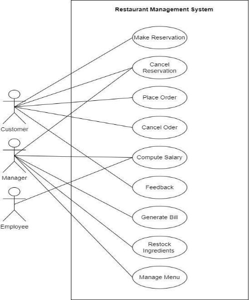

**Use case Specifications**  

**Use Case 1: Cancel Reservation**  

|**Use Case Section**   |**Cancel Reservation**   |
| - | - |
|**Use Case Name**   |Manager cancelling reservation Customer Cancelling reservation   |
|**Scope**   |Restaurant Management System   |
|**Primary Actor**   |Manager Customer   |
|**Stakeholders and Interests**   |
Manager: wants efficient handling of resources in the       restaurant   

Customer: wants to cancel his reservation on time to avoid  cancellation fee (if the customer is not able to come)   
|
|**Preconditions**   |Manager logging into his account Customer logging into his account   |
|**Success Guarantee**   |Reservation cancelled successfully   |
|**Special Requirements**   |
1. Customer or the manager should not feel delay or lag when cancelling the reservation   

2. Cancellation should be instant; The table should 

&emsp;be available for the other customers in less than 

&emsp;10 seconds   
|
|**Technology and Data Variations**  **List**   |None   |
|**Frequency of Occurrence**   |Often     |
|**Miscellaneous (Open Issues)**   |None     |

**Alternate Flows:**

1. At any moment the manager can close the application or system crashes due to any reason. In any case, the manager must relaunch the app and verify himself. 
1. If the manager enters wrong credentials, he needs to try again entering correct credentials. 

|**Actor Action**   |**System Response**   |
| - | - |
|1\. The customer uses the Restaurant Management system to cancel his reservation.  ||
|2\. The customer provides their reservation id.  ||
||3\.The system removes the reservation from the reservation list.  |
||4\.  System will send a notification to the customer that his table is being cancelled.  |

**Alternate Flows:** 

1. At any moment customer can close the application or system crashes due to any reason. In any case, the customer must relaunch the app and verify himself. 
1. If the customer enters wrong credentials, he needs to try again entering correct credentials. 

**Use Case 2: Generate Bill**   

|**Use Case Section**   |` `**Generate bill**   |
| - | - |
|**Use Case Name**   |Manager generates bill   |
|**Scope**   |Restaurant Management System   |
|**Primary Actor**   |Manager   |
|**Stakeholders and Interests**   |Manager: wants generation of bill of respective table on time Customer wants correct bill to be generated    |
|**Preconditions**   |Manager logging into his account   |
|**Success Guarantee**   |Bill generated successfully   |
|**Special Requirements**   |1\. Manager should not feel delay or lag when generating the bill   |
|**Technology and Data Variations**  **List**   |None   |
|**Frequency of Occurrence**   |Frequently   |
|**Miscellaneous (Open Issues)**   |None   |

|**Actor Action**   |**System Response**   |
| - | - |
|1\.The Manager uses the Restaurant  Management system to generate bill.  ||
|.  |2The system displays the current order list with order Id’s.  |
|3\. Manager selects the order id from the order List  ||
||4\. The system will calculate the bill and add taxes   |
|5\. The Manager will confirm the bill.  ||
||6\. The system will print the bill   |

**Alternate Flows:**

1. At any moment, the manager can close the application or system crashes due to any reason. In any case, the manager must relaunch the app and verify himself. 
1. If the manager enters wrong credentials, he needs to try again entering correct credentials. 
1. If the manager adds wrong items into the bill, he needs to delete those items and add correct ones

` `**Use Case 3: Manage Menu**   

|**Use Case Section**    |**Manage menu**   |
| - | - |
|**Use Case Name**    |Manage menu   |
|**Scope**    |Restaurant Management System    |
|**Primary Actor**    |Manager   |
|**Stakeholders and Interests**   |Manager: wants to keep the menu up to date by adding and deleting items.  |
|**Preconditions**    |Manager logging into his account   |
|**Success Guarantee**    |The menu is updated successfully.  |
|**Special Requirements**    |The menu should be updated within 5 seconds.  |
|**Technology and Data Variations**   **List**    |None    |
|**Frequency of Occurrence**    |Rarely   |
|**Miscellaneous (Open Issues)**  |None    |

|**Actor Action**    |**System Response**    |
| - | - |
|1\.The  Manager  uses  the  Restaurant  Management system to manage menu.  ||
|2\. The manager will add, delete, or modify the items in the menu according to the available resources.  ||
||3\. The system will update the menu and display it to the manager.  |
||4\.  System saves all the information.  |

**Alternate Flows:**  

1\. At any time, Manager can cancel the process or System crashes due to any unavoidable reason:  In this scenario the Manager will have to log in again and start the process from the start. 

3\.  The verification fails, and the manager is prompted to enter the correct details. 

**Use Case 4: Make Reservation**  

|**Use Case Section**    |Make Reservation   |
| - | - |
|**Use Case Name**    |Make Reservation   |
|**Scope**    |Restaurant Management System   |
|**Primary Actor**    |Customer   |
|**Stakeholders and Interests**    |Customer: Wants to make a reservation at the restaurant beforehand to save them from the hassle of waiting for a free table at the restaurant venue   |
|**Preconditions**    |
1. Customer needs to log in.  

2. Customer’s login details are authentic   
|
|**Success Guarantee**    |The table is reserved, and reservation details are stored in the system. |
|**Special Requirements**   |Information in a database is stored within one second.  |
|**Technology and Data Variations List**    |None   |
|**Frequency of Occurrence**    |Often   |
|**Miscellaneous (Open Issues)**  |If two people, try to reserve the same table simultaneously   |

||**Actor Action**   ||**System Response**   |
| :- | - | :- | - |
||1\.  The customer uses the Restaurant |||
||Management System to make a |||
||reservation for a table.  |||
|||2\.   |The system displays available tables for |
||||reservation.  |
||3\.  the customer selects a table and provides |||
||a specific number of people, date, and |||
||time.  |||
|||3\.   |The system reserves the table.  |
|||||
|||5\.  |The system generates the reservation  |
||||ID.  |

**Alternate Flows:**    

\*a. At any time, the customer can cancel the reservation process:   \*b. At any time, there is an electricity failure:   

\*c. At any time, system crashes:   

1\. The customer will have to start the process from the beginning   

**Use Case 5: Make Order**  

|**Use Case Section**    |**Make Order**   |
| - | - |
|**Use Case Name**    |Make Order   |
|**Scope**    |Restaurant Management System    |
|**Primary Actor**    |Customer   |
|**Stakeholders and Interests**    |
1. Customer: Wants to order his food easily without having to wait for a waiter to take their order.  

2. Chef: Needs a list of orders to start cooking.  

3. Owner: Needs customers to make orders to generate income. 
|
|**Preconditions**    |
1. Customer needs to log in.  

2. Customer’s login details are authentic.  
|
|**Success Guarantee**    |All the items ordered by the customer are stored and can be viewed by the chef upon order process completion.  |
|**Special Requirements**    |
1. Information in a database is stored within one second.  

2. Order must be displayed to the chef within 3 seconds.  
|
|**Technology and Data Variations List**    |None    |
|**Frequency of Occurrence**    |Often   |
|**Miscellaneous (Open Issues)**  |If there are ingredients (for a certain item) for only one order but is ordered by two customers simultaneously.  |
||**Actor Action**   ||**System Response**   |
| :- | - | :- | - |
||1\.  The customer uses the Restaurant   |||
||Management System to place an order.  |||
||||1\.  System creates a new Cart.  |
||||2\.  The system displays the menu with a list of |
||||menu items.  |
||3\.  The customer Selects an item from the |||
||menu and selects desired quantity of the |||
||item and adds to Cart.  |||
||||4\.  The system creates a new order item and |
||||stores the quantity and id of that item.  |
|||||
||5\.  Customer repeats steps 3-8 until order is |||
||completed.  |||
||||6\.  The system displays the total number of |
||||items and order id.  |

` `**Alternate Flows:**    

\*a. At any time, the customer can cancel the order process:   

\*b. At any time, there is an electricity failure:   

\*c. At any time, system crashes:   

1\. The customer will have to start the process from the beginning.  

. The customer wants to cancel Order/item.  

•   The customer is redirected to cancel order to delete the order completely or to delete an item   

**Use Case 6: Restock Ingredients**  

|**Use Case Section**    |Restock Ingredients  |
| - | - |
|**Use Case Name**    |Restock Ingredients  |
|**Scope**    |Restaurant Management System   |
|**Primary Actor**    |Manager   |
|**Stakeholders and Interests**    |
Owner:  Does  not  want  to  lose  customers  due  to  shortage  of ingredients in the inventory   

Manager: Needs to make sure inventory storage has all the required ingredients with the necessary quantity. Customer: Would prefer not to cancel their order due to shortage of ingredients.  
|
|**Preconditions**    |
1. The manager needs to log in.  

2. Manager login details are authentic.  
|
|**Success Guarantee**    |
1. Order for ingredients has been stored in the database.  

2. The order has been successfully sent to the supplier.  
|
|**Special Requirements**    |
1. Information in the database is stored within one second. 

2. Order must be sent to the supplier in real time (1 second delay).  
|
|**Technology and Data Variations List**    |None   |
|**Frequency of Occurrence**    |Weekly (depends on customer inflow in the restaurant).  |
|**Miscellaneous (Open Issues)**  |None   |
||**Actor Action**   ||**System Response**   |
| :- | - | :- | - |
||1\.. The manager uses the Restaurant |||
||Management System to restock |||
||ingredients.  |||
||2\.  The manager provides a specific ingredient |||
||id and its quantity.  |||
||||3\. The system asks for verification to add the |
||||desired ingredients in inventory.  |
||4\. The manager gives confirmation.  |||
||||5\.The system updates the inventory.  |

**Alternate Flows:**    

\*a. At any time, the customer can cancel the ingredient ordering process:   \*b. At any time, there is an electricity failure:   

\*c. At any time, system crashes:   

1\. The customer will have to start the process from the beginning.  

**Use Case 7: Give Feedback**  

|**Use Case Section**   |**Give Feedback**  |
| - | - |
|**Use Case Name**   |Give Feedback  |
|**Scope**   |Restaurant Management System   |
|**Primary Actor**   |Customer  |
|**Stakeholders and Interests**  |` `Customer: wants to give their regards for the services of the restaurant so they can work on them.  |
|**Preconditions**   |Customer can log in   |
|**Success Guarantee**   |The feedback foam filled by the customer is saved and displayed.  |
|**Technology and Data Variations List**   |None   |
|**Frequency of Occurrence**   |Occasional   |
|**Miscellaneous (Open Issues)**   |None   |

|**Actor Action**   |**System Response**   |
| - | - |
|1\.  The customer uses the Restaurant  Management system to give feedback.  ||
|2\.  The customer provides feedback regarding his order.  ||
| - | :- |
||3\. System saves the information entered by the customer   |
|||
**Alternate Flows:**   

1\. At any time, customer can cancel the process or System crashes due to any unavoidable reason:  In this scenario customer will have to log in again and start the process from the start.  

2a. The verification fails and the customer is prompted to enter correct details   

**Use Case 8: Compute Salary** 

|**Use Case Section**   |**Compute Salary**  |
| - | - |
|**Use Case Name**   |Compute Salary  |
|**Scope**   |Restaurant Management System   |
|**Primary Actor**   |Admin/Manager  |
|**Stakeholders and Interests**   |
•   Manager: wants to compute the salary of his employees in an easy and organized way.  

Manager also wants to keep the record that how many hours that employee has worked in that month.  
|
|**Preconditions**   |The Admin/Manager are logged into the account.  |
|**Success Guarantee**   |The salary is computed, and the record is saved.  |
|**Technology and Data Variations List**   |None   |
|**Frequency of Occurrence**   |Frequently.  |
|**Miscellaneous (Open Issues)**   |None.  |

|**Actor Action**   |**System Response**   |
| - | - |
|
1\.. The Manager uses the Restaurant  

Management system to compute salaries. 
||
|2\.  The Manager provides the employee id.  ||
||
3\. The system will display all the details against 

that id number which includes number of hours worked in a month.  
|
| :- | - |
||4\.The system ask for verification of details to print the salary.  |
|5\.   The Manager confirms the details   ||
||6\. The system prints the monthly pay of the employee based on the number of hours worked.  |

` `**Alternate Flows:**   

1\. At any time, customer can cancel the process or System crashes due to any unavoidable reason:  In this scenario customer will have to log in again and start the process from the start.  

2a. If the admin enters the wrong credentials of that employee, he needs to try again entering correct credentials.  

**Use Case 9: Cancel Order**

|**Use Case Section**   |**Cancel Order**  |
| - | - |
|**Use Case Name**   |Cancel Order  |
|**Scope**   |Restaurant Management System   |
|**Primary Actor**   |Customer  |
|**Stakeholders and Interests**  |
Customer: wants to cancel his order in time to avoid any 

kind of inconvenience.  
|
|**Preconditions**   |Customer logging into his account  |
|**Success Guarantee**   |The order is cancelled successfully.  |
|**Technology and Data Variations List**   |None   |
|**Frequency of Occurrence**   |Often  |
|**Miscellaneous (Open Issues)**   |None   |

|**Actor Action**   |**System Response**   |
| - | - |
|1\.  The customer uses the Restaurant  Management system to cancel his order.  ||
|.      2. The customer provides his order id. ||
||
3\. The system cancels the order and removes it 

from the order List.  
|
| :- | - |
||4\. System generates a notification notifying us that your order has been cancelled.  |

**Alternate Flows:**   

1\. At any time, customer can cancel the process or System crashes due to any unavoidable reason:  In this scenario customer will have to log in again and start the process from the start. 2a. The verification fails and the customer is prompted to enter correct details   

**Domain Model**  

*Figure 1: Domain Model* 

**Class Diagram**  

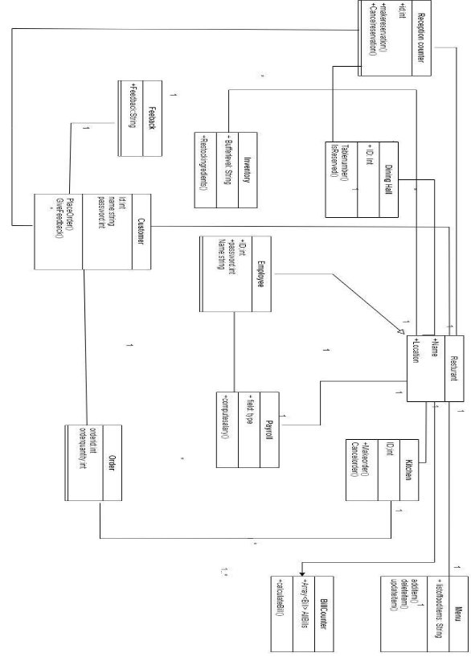

**System Sequence Diagrams**  

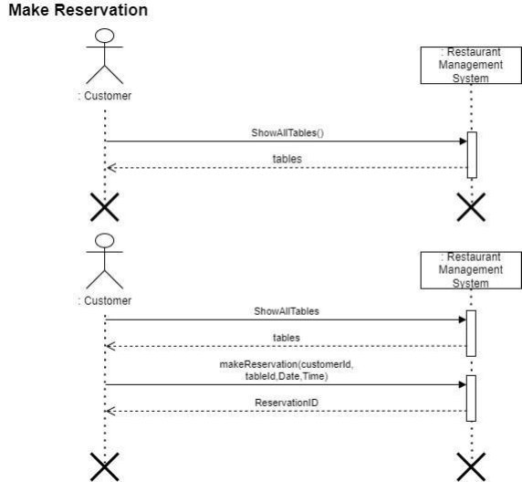

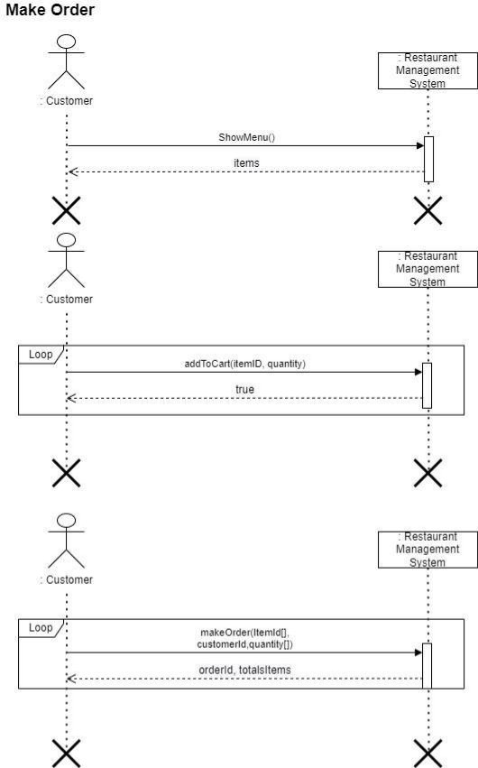

` `

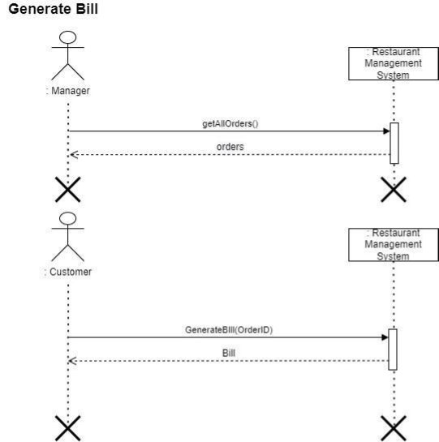

**Design System Sequence Diagrams**  

**Make Reservation**  

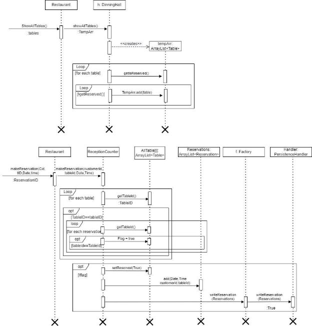

**Cancel Reservation**  

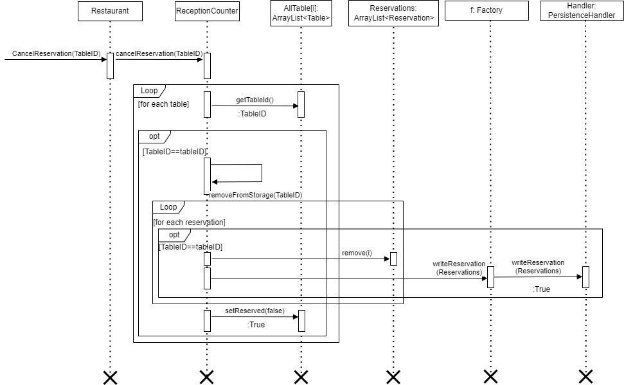

**Restock Ingredients**  

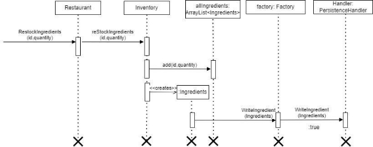

**Make Order**  

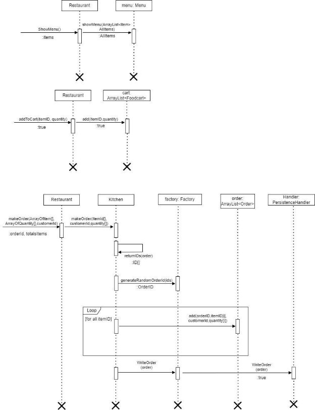

**Cancel Order**  

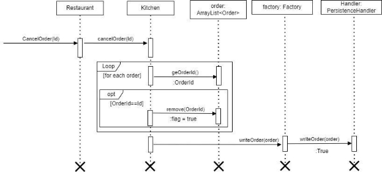

**Add Item**  

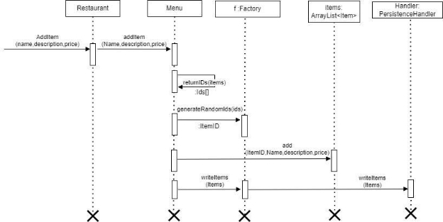

**Delete Item**  

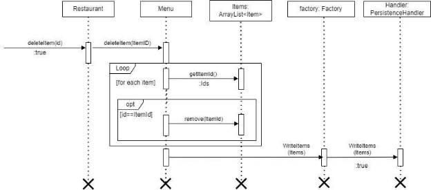

**Edit Item**  

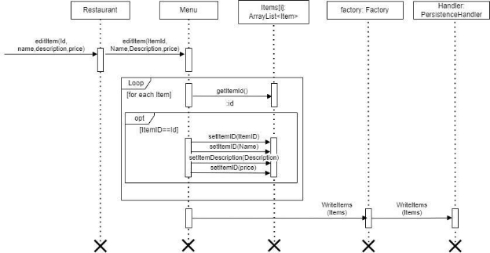

**Compute Salary**  

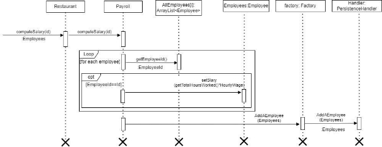

**Generate Bill**  

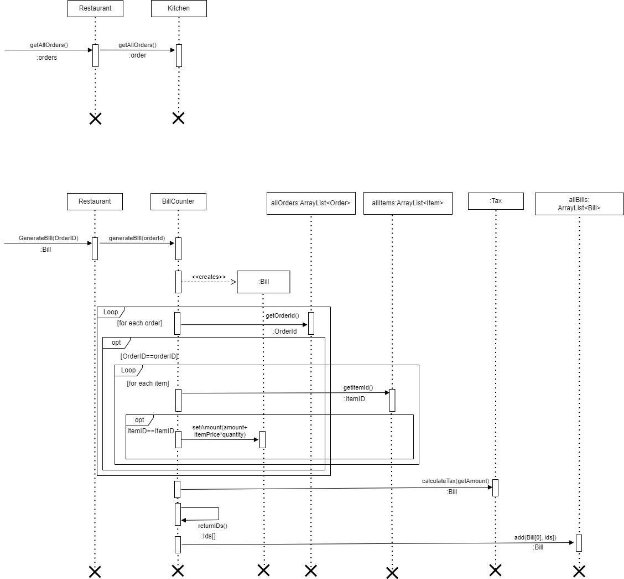

**Give Feedback**  

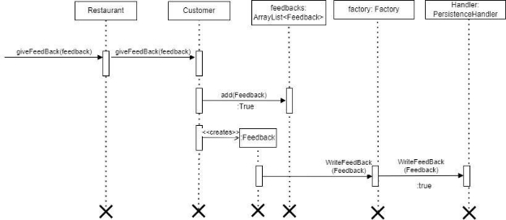
